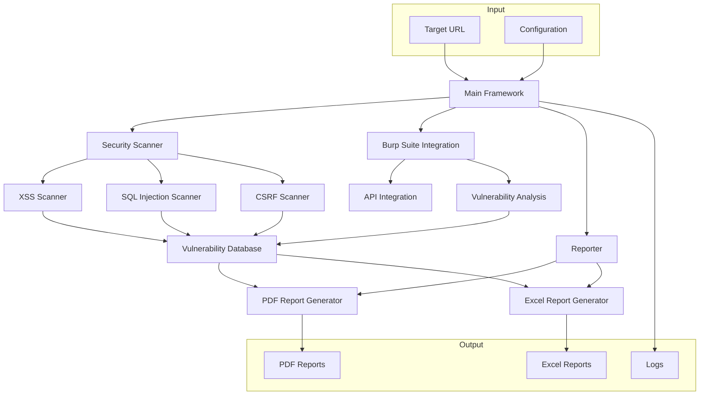

# Web Application Security Testing Framework

A comprehensive automated security testing framework for web applications, integrating multiple security tools for vulnerability assessment and reporting.

## Features

- Automated scanning for OWASP Top 10 vulnerabilities
- Integration with Burp Suite for advanced security testing
- Custom reporting system with severity-based prioritization
- Support for XSS, SQL injection, and CSRF testing
- Comprehensive PDF and Excel report generation
- Configurable scanning options

## Architecture



## Prerequisites

- Python 3.8+
- Chrome browser (for Selenium)
- Burp Suite Professional
- Required Python packages (see requirements.txt)

## Installation

1. Clone the repository:
```bash
git clone https://github.com/mohamedelhajsuliman/Web-Application-Security-Testing-Framework-.git
cd Web-Application-Security-Testing-Framework-
```

2. Create a virtual environment and activate it:
```bash
python -m venv venv
source venv/bin/activate  # On Windows: venv\Scripts\activate
```

3. Install dependencies:
```bash
pip install -r requirements.txt
```

4. Create a `.env` file with your configuration:
```env
BURP_API_KEY=your_burp_api_key
BURP_BASE_URL=http://localhost:8080
```

## Usage

Basic usage:
```bash
python src/main.py https://target-website.com
```

Advanced usage with options:
```bash
python src/main.py https://target-website.com --output-dir ./reports --log-level DEBUG --scan-type full
```

Available command-line options:
- `--output-dir`: Specify the directory for reports (default: ./reports)
- `--log-level`: Set logging level (DEBUG, INFO, WARNING, ERROR)
- `--scan-type`: Choose scan type (quick, standard, full)
- `--exclude`: Exclude specific vulnerability types (comma-separated)
- `--timeout`: Set scan timeout in minutes (default: 30)

Example with multiple options:
```bash
python src/main.py https://target-website.com \
    --output-dir ./custom_reports \
    --log-level DEBUG \
    --scan-type full \
    --exclude "csrf,xss" \
    --timeout 60
```

The framework will:
1. Perform automated security scans
2. Run Burp Suite scans
3. Generate comprehensive reports in PDF and Excel formats
4. Save logs for debugging and analysis

## Report Structure

The generated reports include:
- Executive summary
- Vulnerability details
- Severity levels
- Remediation recommendations
- Technical evidence

## Supported Vulnerability Types

- Cross-Site Scripting (XSS)
- SQL Injection
- Cross-Site Request Forgery (CSRF)
- Security Misconfigurations
- Broken Authentication
- Sensitive Data Exposure
- XML External Entities (XXE)
- Broken Access Control
- Using Components with Known Vulnerabilities
- Insufficient Logging & Monitoring

## Contributing

1. Fork the repository
2. Create your feature branch (`git checkout -b feature/AmazingFeature`)
3. Commit your changes (`git commit -m 'Add some AmazingFeature'`)
4. Push to the branch (`git push origin feature/AmazingFeature`)
5. Open a Pull Request

## License

This project is licensed under the MIT License - see the LICENSE file for details.

## Acknowledgments

- OWASP for vulnerability guidelines
- Burp Suite for their API
- Selenium for web automation capabilities 